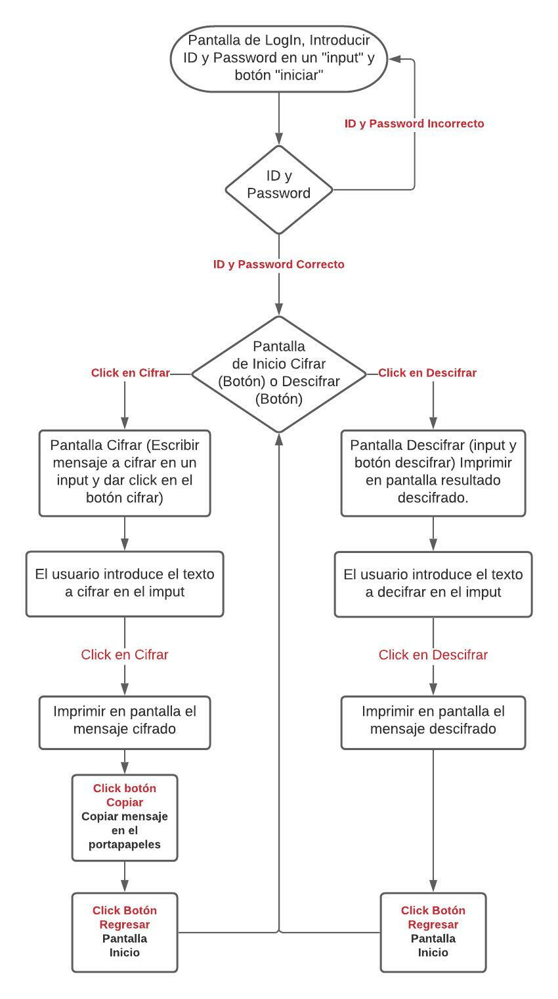

# 03_SecurityCypher

---

Índice

    1. Descripción
    2. Necesidades del Cliente
    3. App Cifrado y Descifrado
    4. Diagrama de Flujo
    5. Maquetado
    6. Pseudocódigo

---

## 1. Descripción

Se necesita una aplicación que pueda cifrar y descifrar texto, mensajes que serán reenviados por diferentes medios a través del celular, como mensajes de texto sms y whats.

---

## 2. Nececidades del cliente

Cliente:
Jefe de seguridad de un club nocturno

Necesidades:
El jefe de seguridad necesita comunicarse con sus empleados de manera rápida y segura, cifrando los mensajes de texto que envía entre sus trabajadores, en cualquier lugar, en cualquier momento y utilizando otras apps de mensajería como whatsapp y sms.

---

## 3. Aplication de Cifrado y Descifrado de texto

Aplicación para móviles, diseñada para cifrar y descifrar texto de manera rápida y segura, para poder ser copiado y enviado a través de otra aplicación como whatsapp o mensajes de texto sms.
La aplicación tiene una pantalla de inicio y bienvenida en donde se selecciona la acción a realizar, cifrar o descifrar.
Al seleccionar cifrar dirige a una nueva ventana con la casilla "input" para agregar el texto que se desea cifrar, a continuación un botón que activa la función "cifrar". Al dar click en el botón responderá con una nueva casilla que devuelve el mensaje cifrado listo para ser copiado.
Al seleccionar descifrar dirige a una ventana con la casilla "input" para agregar el texto a descifrar, a continuación un botón que activa la función descifrar, al dar click nos devolverá el mensaje descifrado.

---

## 4. Diagrama de Flujo



---

## 5. Maquetado

   

Prototipo : https://marvelapp.com/prototype/698c159/screen/82441596

---

## 6. Pseudocódigo

1.Psudocodigo del index.js:

```

La UI se divide en 4 pantallas, pero al iniciar solo se muestra la pantalla 1
Se oculra la segunda, tercera y cuarta pantalla
Se "jala" el elemento boton del html con id=Ini
se agrega un addEventListener a el boton y cuando se clickea ejecuta:
obtiene el valor del input "usuario" y lo guarda en la variable usuario
obtiene el valor del input "pass" y lo gurda en password
se establece el usuario y la contraseña y si se cumplen las condiciones se ejectua:
se oculta el header
se oculta la pantalla 1
se muestra la pantalla
si la contraseña y el usuario no son los correctos muestra en la consola el mensaje:
"Contraseña o/y usuario no validos"

en la segunda pantalla se muestran dos botones, uno con el boton "cifrar" y el otro "descifrar"
se agrega un evento al boton de cifrar y si es clickeado ejecuta:
se oculta la pantalla 1
se oculta la pantalla 2
se oculta la pantalla 3
se muestra la pantalla 4
se agrega un evento al boton de descifrar y si es clickeado ejecuta:
se oculta la pantalla 1
se oculta la pantalla 2
se oculta la pantalla 4
se muestra la pantalla 3

se agrega un evento al boton "bdescifrar"
si se clickea se ejecuta
obtiene el valor del input "acifrar" y lo guarda en la variable textd
obtiene el valor del input "key" del html y lo guarda en la variable "key2"
Substituye lo que hay en "parrafoCifrar" por el valor que te regresa cipher.encode(key2,textd

agrega un addEventListener a el boton "regresaDes" y si se clickea ejecuta:
se oculta la pantalla 3
se oculta la pantalla 4
se muestra la pantalla 2

agrega un addEventListener a el boton "regresaCi" y si se clickea ejecuta:
se oculta la pantalla 4
se oculta la pantalla 3
se muestra la pantalla 2


```

2.Pseudocodigo cipher.js

```

Se implementacion del objeto "cipher" el cual se exporta en el objeto global "window"

Se implementa el primer metodo llamado "encode":
si el tipo de dato ingresado no es "string" devuelve "Error, ingrese una cadena de caracteres"
crea una cadena de caracteres vacia, la cual vamos a regresar al final de la función
En un bucle for para ir revisando letra por lerta de la cadena de caracteres
revisa si el caracter es mayuscula
agrega a la cadena de caracteres vacia la letra ya desplazada
revisa si el caracter es minuscula
agrega a la cadena de caracteres vacia la letra ya desplazada
si no es mayuscula o minuscula
agrega otro caracter que no sea mayuscula o minuscula a la cadena de caracteres
finalmente regresa la cadena de caracteres "codificada" o desplazada

Se implementa el segundo metodo llamado "encode"
Es lo mismo que el metodo encode, solo cambia el offset, es decir el numero de caracteres desplazado
rotar la cadena de caracteres hacia el sentido contrario es equivalente a rotar la cadena una vez completamente menos el numero de desplazamientos que queremos
se implemento de esta manera en el metodo decode.


```

## Testing

Usuario: "usuario" 
Contraseña: "123"
El producto paso las pruebas unitarias implementadas hasta la fecha, quedan pendientes dos pruebas más.
Producto Final: https://albertoouu.github.io/03_SecurityCypher-/src/index.html

---

## Deployment

oct/8/2021
